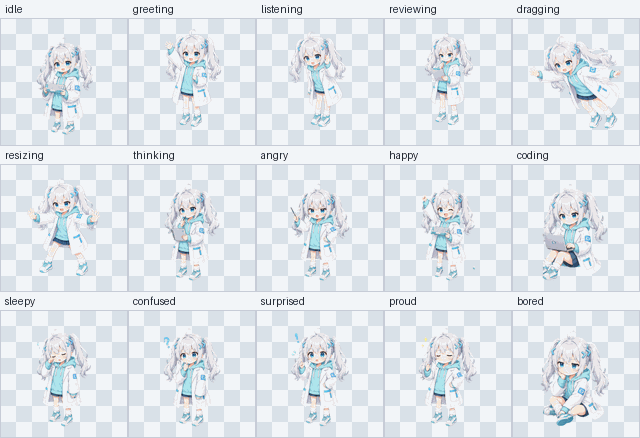

# CodingPet

CodingPet 是一个悬浮在桌面上的编程伙伴。它使用 PyQt6 渲染透明、置顶、可拖拽缩放的桌面宠物，通过 OpenAI 兼容的 Chat Completions 接口进行对话，也可以周期性观察当前 IDE 窗口并给出简短代码评论。



## 功能

- 透明置顶桌面宠物窗口，默认停靠在屏幕右下角。
- 15 种状态动画：`idle`、`greeting`、`listening`、`reviewing`、`dragging`、`resizing`、`thinking`、`angry`、`happy`、`coding`、`sleepy`、`confused`、`surprised`、`proud`、`bored`。
- 每个状态优先加载 `assets/<state>/frame_*.png` 动画帧，当前素材为每个状态 32 帧；缺失时会回退到对应静态图。
- 双击宠物打开输入框，发送消息时会尽量附带当前屏幕截图，让模型结合代码、报错或 IDE 状态回答。
- 可配置的后台观察线程会识别活动窗口标题中的 IDE 关键词，截取活动窗口并调用视觉模型主动评论。
- 支持随机心情切换，聊天、观察、拖动和缩放时会自动暂停随机切换。
- 支持像普通窗口一样从边缘或角落拖动缩放，也支持鼠标滚轮调整大小。

## 环境要求

- Windows 桌面环境推荐。项目使用了 `mss` 截图、`pygetwindow` 活动窗口检测，并在 Windows 上额外处理透明窗口边框。
- Python 3.10+。
- 一个 OpenAI 兼容的接口地址，且至少需要文本聊天模型；如果要启用截图理解和观察能力，还需要支持图像输入的视觉模型。

依赖记录在 `requirements.txt`：

```txt
PyQt6
Pillow
mss
pygetwindow
openai
PyYAML
```

## 快速开始

在项目根目录执行：

```powershell
py -3 -m venv .venv
.\.venv\Scripts\python.exe -m pip install --upgrade pip
.\.venv\Scripts\python.exe -m pip install -r requirements.txt
```

创建本地配置文件 `config.yaml`。这个文件已被 `.gitignore` 忽略，适合放本机 API Key。

```yaml
llm:
  base_url: "https://your-openai-compatible-endpoint/v1"
  api_key: "<your-api-key>"
  vision_model_name: "your-vision-model"
  chat_model_name: "your-chat-model"

pet_preset:
  personality_prompt: "一个嘴毒但靠谱的资深工程师，能快速指出坏代码的问题，并给出有用建议"

observer:
  enabled: true
  interval_seconds: 300
  ide_keywords:
    - "Code"
    - "Cursor"
    - "IDEA"
    - "PyCharm"
    - "Visual Studio"

runtime:
  request_timeout_seconds: 20
  message_duration_ms: 7000
  state_reset_ms: 6000
  random_mood_enabled: true
  random_mood_min_seconds: 8
  random_mood_max_seconds: 20
  sprite_size: 300
  sprite_min_size: 160
  sprite_max_size: 560
```

启动：

```powershell
.\.venv\Scripts\python.exe main.py
```

## 使用方式

- 双击宠物：打开聊天输入框。
- 输入框中按 `Enter`：发送消息。
- 输入框中按 `Esc` 或失去焦点：取消输入。
- 左键拖动宠物中间区域：移动窗口。
- 左键拖动边缘或角落：按普通窗口方式缩放。
- 右键拖动宠物：缩放。
- 鼠标滚轮：放大或缩小宠物。

模型回复建议保持下面格式，这样宠物可以根据状态切换表情动画：

```text
[STATE] 一句简短回复
```

`STATE` 可使用上面功能列表中的状态名，例如 `[CODING]`、`[THINKING]`、`[HAPPY]`。如果模型没有按格式输出，程序会尽量解析，并默认回到 `IDLE`。

## 配置说明

`llm`：

- `base_url`：OpenAI 兼容接口地址。
- `api_key`：接口密钥。不要提交到仓库。
- `vision_model_name`：带图像输入的模型，用于截图聊天和观察线程。
- `chat_model_name`：纯文本聊天模型。如果截图请求遇到“不支持图像输入”的错误，主动聊天会自动降级为纯文本重试。

`pet_preset`：

- `personality_prompt`：宠物的人设，会注入聊天和观察提示词。

`observer`：

- `enabled`：是否开启后台观察。
- `interval_seconds`：观察间隔，代码中最小值为 5 秒。
- `ide_keywords`：活动窗口标题包含这些关键词时，观察线程才会截图并请求模型。

`runtime`：

- `request_timeout_seconds`：LLM 请求超时，代码中最小值为 5 秒。
- `message_duration_ms`：气泡消息显示时长。
- `state_reset_ms`：模型回复状态保持多久后回到 `idle`。
- `random_mood_enabled`：是否启用随机心情。
- `random_mood_min_seconds` / `random_mood_max_seconds`：随机心情切换间隔。
- `sprite_size` / `sprite_min_size` / `sprite_max_size`：宠物初始大小和缩放边界。

## 项目结构

```text
.
├── main.py                 # 应用入口和状态调度
├── ui_core.py              # PyQt 透明窗口、动画、气泡、输入框、拖拽缩放
├── llm_client.py           # OpenAI 兼容接口调用和模型回复解析
├── chat_thread.py          # 主动聊天线程，包含屏幕截图
├── observer_thread.py      # IDE 活动窗口观察线程
├── config_loader.py        # config.yaml 加载和默认值约束
├── pet_state.py            # 宠物状态枚举和情绪映射
├── logging_utils.py        # 控制台和 codingpet.log 日志
├── assets/                 # 静态素材、动画帧、源图和预览图
└── tools/                  # 素材重建、预览和校验工具
```

## 素材维护

运行帧校验，检查每个状态至少 24 帧、透明角、可见像素和中心漂移：

```powershell
.\.venv\Scripts\python.exe tools\validate_pet_frames.py
```

生成预览图，会写入 `assets/reference/animation-preview-sheet.png`：

```powershell
.\.venv\Scripts\python.exe tools\preview_pet_frames.py
```

从 `assets/source/*_source.png` 重建所有状态的 512x512 固定画布 PNG 动画帧：

```powershell
.\.venv\Scripts\python.exe tools\rebuild_pet_actions.py
```

如果有新的 5x2 动作设定图，也可以传入图片并保存到 `assets/reference/`：

```powershell
.\.venv\Scripts\python.exe tools\rebuild_pet_actions.py path\to\action-sheet.png --reference-name codingpet-action-sheet-v3.png
```

默认运行时优先使用 PNG 帧，以减少透明边缘残影和压缩光晕。只有明确需要 WebP 帧时再加 `--with-webp-frames`。

## 开发检查

语法检查：

```powershell
.\.venv\Scripts\python.exe -m py_compile main.py ui_core.py chat_thread.py observer_thread.py llm_client.py config_loader.py pet_state.py logging_utils.py
```

素材检查：

```powershell
.\.venv\Scripts\python.exe tools\validate_pet_frames.py
```

只预览透明宠物窗口，不启动完整控制器：

```powershell
.\.venv\Scripts\python.exe ui_core.py
```

## 日志和排障

- 运行日志会同时输出到控制台和 `codingpet.log`。
- 如果启动后立即退出，优先检查 `config.yaml` 是否存在，以及 `llm.base_url`、`llm.api_key`、模型名是否填写。
- 如果聊天可用但截图相关请求失败，确认 `vision_model_name` 对应模型支持 `image_url` 输入。
- 如果观察线程没有主动评论，确认当前活动窗口标题包含 `observer.ide_keywords` 中的关键词。
- 如果动画出现漂移、边缘光晕或残影，先运行 `tools\validate_pet_frames.py`，并确认状态帧仍是固定画布 PNG。
